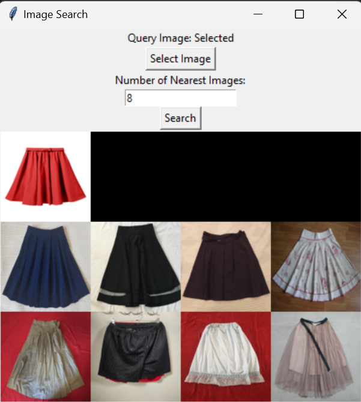

# Image Search Application

The Image Search Application is a Python program that allows users to perform nearest neighbor searches on a collection of images using a pre-trained ResNet-50 model and the Annoy library for efficient approximate nearest neighbor search.

## Features

- Select a query image from your local file system.
- Specify the number of nearest images to retrieve.
- Perform a nearest neighbor search using the pre-trained ResNet-50 model.
- Display the query image and the retrieved nearest images in a grid.

## Prerequisites

Before running the application, ensure you have the following dependencies installed:

- Python 3.x
- Required Python packages (install via `pip` using `requirements.txt`):

## Additional Information

The images_folder variable in the code should be set to the path of the folder containing your image dataset.
The pre-trained ResNet-50 model is used for feature extraction from images.
Annoy is used for efficient approximate nearest neighbor search based on the extracted features.